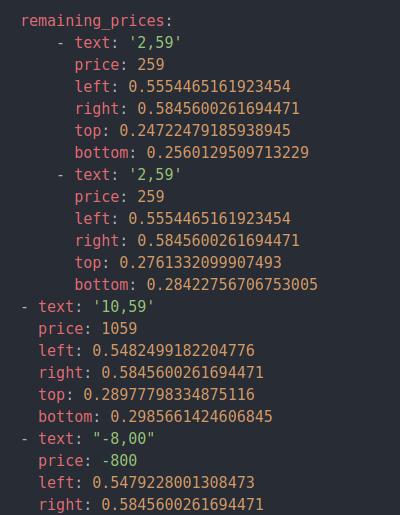

# Datageneration for machine learning - Workflow
##0. Get access
You need access to the S3 (files) and github (error report).

Via the web you can not download multiple files from S3, so one way is to use a program like "Cyberduck" to download / move / delete files on S3. Another possiblity is to zip several files (e.g. 20), upload them to s3 and everyone how processes the bills downloads one zip file, deletes it from s3, process the included bills and uploads it with a different name (e.g. "done_OriginalName").

## 1. Opening the next bill

Open one bill from the "InProcess"  folder. Copy the id (e.g. ZwkzBBdB3SH45PbRi) and open the bill in the web app with
~~~shell
https://my.chillbill.co/bills/ZwkzBBdB3SH45PbRi
~~~
by changing the example bill id to its actual bill id.
## 2. Check dimensions

__All coordinates are relative (between 0 and 1) to the scan dimension. The origin is the top left corner of the scan.__

Check if the coordinates of the textbox make sense by comparing them with the scanned image. So you have to look at the values `text_box_top:`, ` text_box_bottom:`, `
  text_box_left:` and `text_box_right:`. 
  
  If there are weird coordinates (e.g. greater than 1) stop and report an error in the rubrik "Wrong text_box dimensions".

## 3. Check bill_format

Is the bill of type `A4`, `sales_check` or `email`? Write the correct one to `bill_format`. (The default is `A4`).

## 4. Check total_prices_candidates

1. If there is no candidate stop and report an error in the rubrik "Prices missing".

2. If there is only one candidate check if it is correct by looking at the amount.

3. If there are more than one candidate,  find the correct one by looking on the coordinates. Move the others into `remaining_prices`. 

## 5. Check vat_prices_candidates

1. If there is no candidate stop and report an error in the rubrik "Prices missing".

2. If there is only one candidate check if it is correct by looking at the amount.

3. If there are more than one candidate,  find the correct one by looking on the coordinates. Move the others into `remaining_prices`. 

## 6. Check remaining_prices
1. Check all prices in `remaining_prices` if they are actual prices. If someting eles (e.g. phone number, adress, weight, percentage, ...) gets recognized as price delete this price and its coordinates and report an error in the rubrik "Something else recognized as price ". In this case we can still use the bill.

2. While checking the remaining prices you also have to check for missing prices. Are there any prices on the bill (scan) that do not appear on the list? If so stop and report an error in the rubrik "Prices missing".

## 7. Correct formatting
i. In the rubrik "total_prices_candidates" change the name "total_prices_candidates" to "total_prices". Also replace the "-" with a space. 

Example:
  becomes  

ii. In the rubrik "vat_prices_candidates" change the name "vat_prices_candidates" to "vat_prices". Also replace the "-" with a space. 

Example:
  becomes  

iii. If you moved prices from "total_prices_candidates" or "vat_prices_candidates" to "remaining_prices" the format is most likely incorrect. You have to shift the parts you moved left. In the editor "Atom" you can mark the parts you want to shift and press `shift` and `tab` at the same time.

Example:
  becomes  

## Action "stop"
If you have to stop to work on the bill because of any problem mentioned above, report an error, delete the file (bill) with the error and start with a new bill.

## Action "report an error"
To solve problems with the recognizer we need "bad" examples. In the following project you can report any error. 
~~~
https://github.com/clemenshelm/chillbill-recognizer/projects/6
~~~
Just press in  the correct column on the "+" sign to add a new note. Insert the bill id __with the file type__ (e.g. .pdf, .jpg, .tiff, ..). You can find the file tye at the end of the second line (image_url). For every possible error, there should be a column. If you find an error and there is no column for it, please tell the person in charge.

## 8. Finish
If you do not need to stop because of any error, save the file and move it to the folder "done". Then start with a new bill :)
